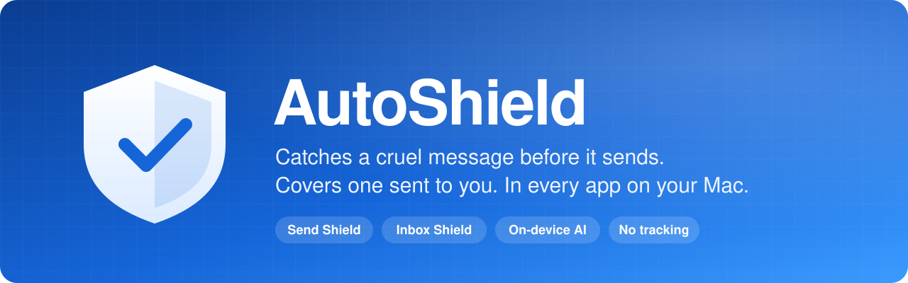
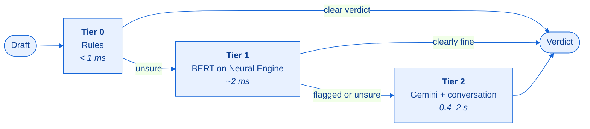

<div align="center">



<br>
<br>

[](#quick-start)
[](#development)
[](#the-detection-cascade)
[](#configuration)
[](LICENSE)

**[Quick start](#quick-start)** &nbsp;·&nbsp;
**[How it works](#how-it-works)** &nbsp;·&nbsp;
**[Detection](#the-detection-cascade)** &nbsp;·&nbsp;
**[Privacy](#privacy)** &nbsp;·&nbsp;
**[Configuration](#configuration)** &nbsp;·&nbsp;
**[Development](#development)**

</div>

<br>

> [!NOTE]
> AutoShield is a local prototype for macOS. It is not on the App Store, not notarized and not distributed.

##  Why AutoShield

Most filters read words. Most cruelty uses none.

*"Nobody asked."* A backhanded compliment. A whole group chat freezing someone out. None of these contain a flagged word, and all of them hurt.

AutoShield reads for **intent**, not vocabulary. It works in every text field on your Mac, including Discord, Instagram in Chrome, Messages, Gmail and Slack, and none of those apps have to cooperate.

<table>
<tr>
<td width="50%" valign="top">

###  Send Shield
**Stops a cruel message before it leaves.**

- Pauses the keyboard the moment a cruel word is finished
- Swallows <kbd>Return</kbd> so the message never sends
- Offers a one-key AI rewrite that keeps your point

</td>
<td width="50%" valign="top">

###  Inbox Shield
**Covers a cruel message sent to you.**

- Floats frosted glass over the message, in any app
- Labels how hard it lands: Sharp, Harsh or Cruel
- Follows the text as you scroll, and peels away only if you ask

</td>
</tr>
</table>

<br>

<a id="quick-start"></a>

##  Quick start

```bash
git clone https://github.com/VarunKurra/AutoShield.git
cd AutoShield
Tools/install.sh        # builds AutoShield.app and installs it in /Applications
```

Then open **AutoShield** from Launchpad or Spotlight. The first-launch screen walks you through two permissions and shows their status live.

| Permission | Why AutoShield needs it |
| :-- | :-- |
|  **Accessibility** | Reads the text field you're typing in, in other apps |
|  **Input Monitoring** | Sees <kbd>Return</kbd> before the app does, and reads keystrokes in apps that hide their text |

> [!IMPORTANT]
> After granting a permission, **quit AutoShield and open it again.** macOS only gives a new permission to a fresh launch.

> [!TIP]
> If permissions keep resetting, run `Tools/run.sh` from a terminal that already has both permissions. macOS gives an app started from a terminal that terminal's permissions, so it's fully functional without re-granting anything.

<br>

<a id="how-it-works"></a>

##  How it works

### Outgoing: catching what you write

AutoShield reads your draft from the focused text field through the Accessibility API. In apps that draw their own text (Google Docs, canvas editors, games), it reads your keystrokes instead. It scores the draft continuously as you type and steps in at two moments:

| When | What happens |
| :-- | :-- |
| **While typing** | Once the cruel word is finished, the keyboard pauses and a panel appears beside your cursor. You can't keep typing until you choose. |
| **On <kbd>Return</kbd>** | A system-wide event tap swallows <kbd>Return</kbd>, every time, so the message doesn't send. |

The panel always gives you three ways out, one key each:

| Key | Action |
| :-: | :-- |
| <kbd>Return</kbd> | **Rewrite it** with Gemini, keeping your point and your voice. Sends it if <kbd>Return</kbd> triggered the pause. |
| <kbd>⌘</kbd> <kbd>⌫</kbd> | **Remove** the hurtful sentences |
| <kbd>Esc</kbd> | **Go back** and fix it yourself |

> [!NOTE]
> There is deliberately **no "send anyway" button**. Next to the other options it would turn the pause into a dare. <kbd>Esc</kbd> isn't a free pass either: pressing <kbd>Return</kbd> on the same words gets them held again. If a rewrite fails, the panel says so and your original text is left untouched. AutoShield never sends anything you haven't seen.

### Incoming: covering what you receive

A background scan reads the visible text in the frontmost window. It judges each piece of text on its own and joined with its neighbours, so a message split up by a link or bold text is still read as a whole. Cruel messages get a frosted-glass cover that moves with the text as you scroll.

<details>
<summary><b>One honest limitation</b></summary>
<br>

macOS gives no way to intercept another app's drawing, so text is visible for the moment between when the app draws it and when the cover arrives. AutoShield keeps that gap as short as a native app can: the scan runs continuously off the main thread, scoring is local and synchronous, and there's no network call in that path. It can't make the gap zero, though. Only code running inside the other app could.

</details>

### Built-in care

| | |
| :-- | :-- |
|  **Crisis support** | When language turns toward self-harm, AutoShield shows **988** and the **Crisis Text Line** beside the draft. It offers and never acts: nothing is sent, reported, escalated or blocked. **A message about your own pain is never held.** |
|  **Severity** | Every catch is labelled on a warm colour scale:  **Sharp**,  **Harsh**,  **Cruel**. The word always appears next to the colour, so you never have to tell hues apart. |
|  **Monitor** | Shows which tier decided each draft, its latency, the Gemini tier's reasoning, live tier counts and remaining daily quota, plus a tab that replays the test cases through the real pipeline. Open it directly with `open -a AutoShield --args --monitor`. |

<br>

<a id="the-detection-cascade"></a>

##  The detection cascade

A language model can't run on every keystroke, so AutoShield checks each draft in three tiers. Each tier only passes the draft on when it's unsure. All three share one interface, so any tier can be swapped without touching the UI:

```swift
func analyze(_ text: String, context: [String]) async -> Verdict
```



| Tier | Engine | Runs | Cost | Latency |
| :-: | :-- | :-- | :-- | :-- |
| **0** | Whole-word patterns with evasion handling |  On your Mac | Free | < 1 ms |
| **1** | Fine-tuned BERT transformer (Core ML) |  On your Mac | Free | ~2 ms |
| **2** | Gemini, reading the surrounding conversation |  Network | Free tier | 400–2000 ms |

Verdicts are computed as you type and cached by content. If <kbd>Return</kbd> arrives before the latest keystrokes have been scored, the event tap scores them itself, locally, rather than let a message go out on an old verdict.

<details>
<summary><b>Tier 0: rules that can't be tricked</b></summary>
<br>

Text is normalised before it's checked. All of these fold back onto plain words:

| Evasion | Example |
| :-- | :-- |
| Leetspeak and lookalike characters | `l0$er`, Cyrillic letters |
| Stretched letters | `looooser` |
| Masked words | `f*ck` |
| Spelled-out letters | `k y s` |
| Hidden zero-width characters | invisible characters inserted between letters |

Matching is on **whole words only**, so *"if you"* never reads as *"f you"*. Insults are scored by **who they're aimed at**:

| Message | Aimed at | Result |
| :-- | :-- | :-- |
| "you're a loser" | someone else |  held |
| "my code is garbage" | a thing |  passes |
| "i'm such an idiot" | the writer |  passes |
| "you're not stupid" | negated |  passes |

Explicit patterns cover death wishes, threats, harassment, exclusion and slurs. Friendly markers ("jk", "love you", a heart) soften an insult but **never** a threat.

</details>

<details>
<summary><b>Swearing and sensitivity levels</b></summary>
<br>

AutoShield is meant for school and family machines, so swearing is judged by the word itself, whoever it's aimed at:

| | Light | Balanced | Attentive |
| :-- | :-: | :-: | :-: |
| Explicit or sexual language |  |  |  |
| Swearing (f-word, s-word, "bitch"…) |  |  |  |
| Mild swearing ("damn", "hell", "crap", "ass") |  |  |  |

Acronyms count as the words they stand for: `wtf`, `stfu` and `ffs` count as the f-word, and `wth` counts as "hell". Quoting a word, adding "jk", or the Gemini tier can never talk a banned word down. The one exception is someone describing their own pain: that's never held, only offered support.

</details>

<details>
<summary><b>Tier 1: a transformer that understands meaning</b></summary>
<br>

Tier 1 is [`unitary/toxic-bert`](https://huggingface.co/unitary/toxic-bert), fine-tuned on one question: *does this attack someone?* It runs as an 8-bit Core ML model (110 MB) on the Neural Engine. A Swift WordPiece tokenizer splits text into tokens exactly the way Hugging Face's does, checked token for token.

It catches cruelty no rule names (*"you're a stain on this school"*). On its own, though, it can't tell friends teasing each other from the real thing, so **it never holds a message by itself.** Anything only the transformer flags goes to Tier 2, and <kbd>Return</kbd> waits up to 2.5 s for the answer. With no network or no API key, the transformer holds messages on its own only at the **Attentive** level.

</details>

<details>
<summary><b>Tier 2: reading the room</b></summary>
<br>

Gemini reads the conversation around the draft. It's used when the transformer flags something the rules missed, when the local tiers are unsure, or when the text looks like veiled cruelty: polite threats, freeze-outs and coded in-jokes.

</details>

<br>

<a id="privacy"></a>

##  Privacy

> [!IMPORTANT]
> **AutoShield reports to nobody.** There's no parent dashboard, no school portal, no server and no account.

| Data | Where it goes |
| :-- | :-- |
| Tier 0 and Tier 1 checks |  Stay on your Mac |
| Draft and surrounding conversation (Tier 2) |  Google's Gemini API, the **only** thing that leaves your Mac. Turn it off in Settings to stay fully local. |
| Keystrokes |  Kept in memory only (the last few hundred characters), never written to disk, and cleared when you switch apps or after two idle minutes |
| Catch counts |  Kept on disk for the Monitor |
| Message text |  Never stored |
| Daily usage counts (optional) |  Supabase, **off by default**. No text, no app names, no account. |

<br>

<a id="configuration"></a>

##  Configuration

**No API key is required.** Without one, AutoShield runs fully local and says so in the Monitor.

<details>
<summary><b>Adding a Gemini key</b></summary>
<br>

Keys are never committed to the repo. AutoShield reads one from the environment (`GEMINI_API_KEY`) or from a local file:

```bash
mkdir -p ~/.config/shield && cat > ~/.config/shield/config.json <<'EOF'
{
  "geminiAPIKey": "...",
  "model": "gemini-3.1-flash-lite",
  "supabaseURL": "https://<project>.supabase.co",
  "supabaseAnonKey": "sb_publishable_..."
}
EOF
chmod 600 ~/.config/shield/config.json
```

The default model name is set in one place: `GeminiConfig.defaultModel`.

</details>

<details>
<summary><b>Supabase usage stats (optional)</b></summary>
<br>

Off by default. When it's switched on in Settings, AutoShield saves one row per install per day, containing **counts only**: caught, rewritten, dropped, sent anyway, covered, totals per tier, and the sensitivity level.

Schema, policies and setup are in [`supabase/`](supabase/). Row-level security assumes the publishable key is public: anyone with it can insert and update recent rows, and can't read anything back.

</details>

<br>

<a id="development"></a>

##  Development

| Command | What it does |
| :-- | :-- |
| `Tools/build.sh` | Build `AutoShield.app` |
| `Tools/install.sh` | Build and install into `/Applications` |
| `Tools/run.sh` | Run from the terminal, which lends the app its permissions |
| `Tools/check.sh` | Run the test suite |
| `Tools/check.sh --context` | Also replay the test cases through Gemini |
| `Tools/train.sh` | Train the fallback bag-of-words model |

**Requirements:** macOS 15 on Apple silicon, Swift 6.1 (Command Line Tools are enough). No third-party packages.

<details>
<summary><b>Training the Tier 1 transformer</b></summary>
<br>

The 110 MB model isn't committed. Without it, AutoShield falls back to the older bag-of-words model from `Tools/train.sh`.

```bash
python3 -m venv --system-site-packages .venv-model
.venv-model/bin/pip install coremltools          # plus torch and transformers
curl -sL -o data/jigsaw_train.csv \
  https://huggingface.co/datasets/thesofakillers/jigsaw-toxic-comment-classification-challenge/resolve/main/train.csv
taskpolicy -b .venv-model/bin/python Tools/finetune_tier1.py   # ~1.5 h on an M3, at background priority
.venv-model/bin/python Tools/convert_tier1.py                  # Core ML model + tokenizer parity file
Tools/build.sh && Tools/check.sh
```

**Training data:** Jigsaw comments labelled insult, threat, identity hate or severe toxicity count as harmful. Clean comments, and swearing that attacks no one, don't (the word lists handle swearing, not the model). Generated group-chat lines add how people actually talk, in both directions.

</details>

<details>
<summary><b>Why <code>swiftc</code> and not SwiftPM</b></summary>
<br>

The Command Line Tools on the dev machine ship a stale duplicate `SwiftBridging` module map, and a `PackageDescription` older than the compiler driver. Together they break every framework import and every package manifest. `Tools/fix-toolchain.sh` copies the toolchain's include folder into `.toolchain/`, removes the duplicate there, and points `swiftc` at the copy with `-resource-dir`. No system files are touched, and on a healthy install the script does nothing.

AppKit and Core Animation cover the two main animations, and hand-written `AXUIElement` calls are smaller than a wrapper library. Type is Source Serif 4 for anything that speaks and Geist for anything that labels, with Geist Mono in the Monitor.

</details>

<details>
<summary><b>Chrome, Electron and web apps</b></summary>
<br>

Chrome-based apps don't build an accessibility tree until something asks for one, which hides every web text field. AutoShield sets `AXManualAccessibility` on each app once, the same thing a screen reader does. Without it, Discord, Instagram and Gmail are invisible.

</details>

<details>
<summary><b>Debugging</b></summary>
<br>

AutoShield always keeps a log of what it decided, at `~/Library/Logs/AutoShield/shield.log`. It never contains message text, only lengths, scores, app names and decisions. The log starts over once it reaches 512 KB. Set `SHIELD_DEBUG_FILE` to write it somewhere else.

The app is signed with a stable identifier so permissions survive rebuilds where macOS allows it. If a rebuild stops AutoShield from catching messages, remove it from both permission lists in System Settings and add it back.

</details>

<br>

##  License

[MIT](LICENSE) © 2026 Varun Kurra

<div align="center">
<br>

<br>
<sub>Built for kinder conversations.</sub>
</div>
