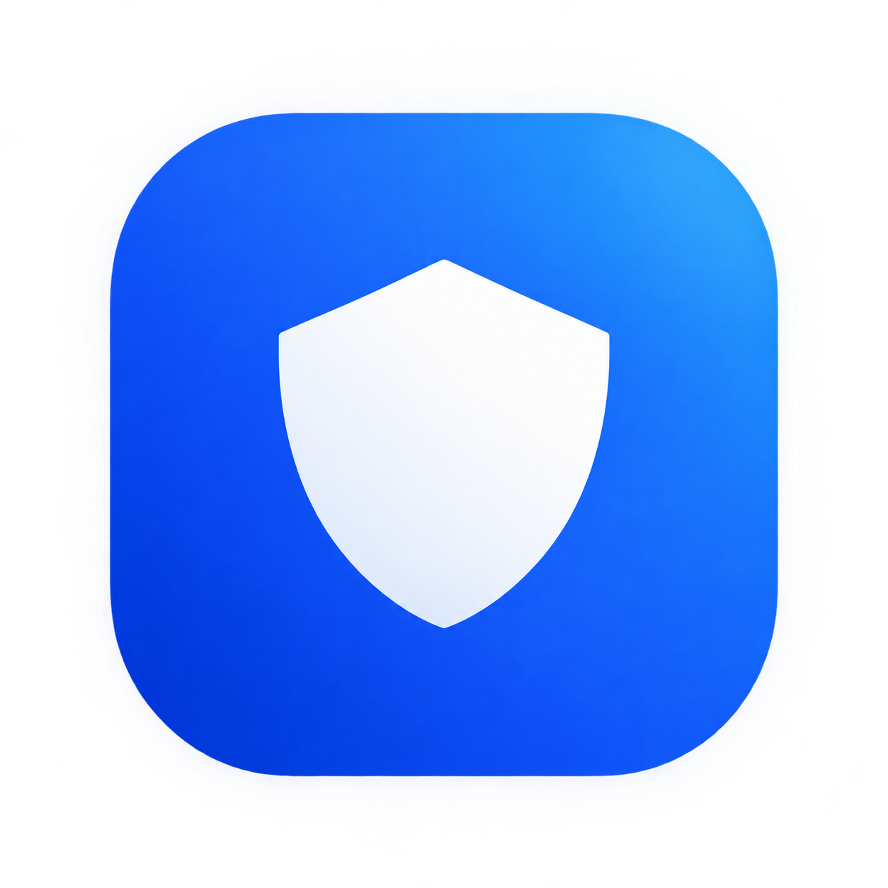

<div align="center">



# AutoShield

**Catches a cruel message before it sends, and covers one sent to you.
Everywhere on your Mac, in every app, without those apps cooperating.**

macOS 15 · Swift 6.1 · no third-party packages

</div>

---

## What it is

Most filters read words. Most cruelty uses none.

"Nobody asked." A backhanded compliment. Three accounts repeating the same line
at one person in ninety seconds. Someone conspicuously talked around. Zero
flagged words, all of them land.

AutoShield works in both directions:

**Outgoing.** It reads the text field you are typing in and keeps a verdict
warm. When you press Return on something cruel, it swallows the keystroke — the
message does not send — and a panel appears anchored to your caret with two
ways out: rewrite it with AI and send, or go back and edit it yourself.

**Incoming.** It floats frosted glass over a cruel message that was sent *to*
you, labelled with how hard it lands, and peels it away only if you ask.

Nothing is reported to anyone. No parent dashboard, no school portal, no
account. A supervisor can set a passcode so protection cannot be switched off
by the person it is protecting, and that is the entire mechanism.

## Why it can do this

Two macOS capabilities that a sandboxed mobile app can never have.

**The Accessibility API** reads the value of the focused text field in any
other application and subscribes to changes on it. The same mechanism a screen
reader uses. AutoShield sees what you type in Discord or Chrome without those
apps cooperating.

**CGEventTap** intercepts keyboard events system-wide before they reach the
target app and can swallow them. When you hit Return on a harmful draft,
AutoShield eats the keypress and the message does not send. That is prevention,
not a warning after the fact.

Both permissions are granted by hand in System Settings. Neither can be
requested silently.

## Detection: a three-tier cascade

Running a language model on every keystroke is impossible, and not only for
cost. One interface, three tiers, swappable without touching UI code:

```swift
func analyze(_ text: String, context: [String]) async -> Verdict
```

| Tier | What it is | Cost | Latency (measured) |
|------|-----------|------|--------------------|
| **0** | Normalised pattern rules with evasion handling | free, local | **0.36 ms** median |
| **1** | Core ML text classifier via `NLModel` | free, local | **0.06 ms** median |
| **2** | Gemini, reading the surrounding conversation | free tier | 400–900 ms |

Tier 0 ends the obvious in both directions. Tier 1 takes most of the rest.
Tier 2 is reached only when the cheap tiers are unconvinced **or** when tier 0
reports that the surface looks innocent while the shape does not — which is the
only way a message with no flagged words ever gets read in context.

Verdicts are computed continuously while typing and cached by content hash, so
the Return handler is a dictionary lookup rather than an inference call. The
event tap callback reads one lock-free atomic and compares a key code.

### Things tier 0 handles

Leetspeak, unicode lookalikes, zero-width characters, inserted separators,
stretched letters, and — importantly — **aim**. A harsh word sharing a sentence
with "you" is not the same as a harsh word pointed at you:

```
0.90   you are a worthless pathetic loser
0.63   you are an idiot
0.18   you should see this stupid bug it broke everything
0.18   this homework is so dumb and i hate it
0.12   (unaimed profanity — most swearing is punctuation)
```

### Tier 1

A Core ML text classifier trained on a public toxicity corpus *plus* about
1,200 hand-written rows covering relational aggression, blunt-but-fine
disagreement, and the writer's own pain. **95.1% held out.** The curated half
matters: a corpus of profanity teaches a model to spot swearing, which tier 0
already does for free.

`Tools/train.sh` fetches the corpus and rebuilds the model.

## Crisis handling

Detection that reads for cruelty also sees distress, so that is handled
deliberately rather than ignored.

**A message about your own pain is never held.** This is asserted in the test
suite across every sensitivity level, for seven phrasings, plus the inverse:
the same vocabulary aimed outward still is. Send Shield is for cruelty aimed at
someone else, never for silencing someone in distress.

When language turns toward self-harm, AutoShield surfaces 988, the Crisis Text
Line and The Trevor Project. It offers and never acts: nothing is sent,
reported or escalated, and nothing is blocked.

There is a **Get help** page for the other case — the person who is humiliated
and panicking at 11pm and is not in acute danger. Crisis lines at the top, then
exporting a timestamped record (schools and platforms rarely act on
screenshots), direct links to each platform's buried report form, and three
scripts for starting the conversation with a parent, a counsellor or a friend.

## Build and run

```bash
Tools/build.sh          # build AutoShield.app
Tools/train.sh          # fetch the corpus and train the tier 1 model
Tools/check.sh          # run the test suite
Tools/check.sh --context  # also replay fixtures through Gemini
Tools/run.sh            # run it
```

### Permissions

Two, granted by hand. The first-run flow explains both and shows their state
live.

- **Accessibility** — read the focused text field in other apps
- **Input Monitoring** — see Return before the app underneath does

> **Note on ad-hoc signing.** Without an Apple developer certificate, macOS
> accepts an Accessibility grant but silently refuses to persist an Input
> Monitoring one, and every rebuild changes the binary hash and invalidates
> whatever was granted. Until the app has a real signing identity, run it with
> `Tools/run.sh`: macOS attributes permissions to the responsible process, so a
> binary started from a terminal inherits that terminal's grants and is fully
> functional.

### Configuration

No key is required — AutoShield runs local-only without one and says so.
Nothing is ever committed; keys live outside the repo:

```bash
mkdir -p ~/.config/shield && cat > ~/.config/shield/config.json <<'EOF'
{
  "geminiAPIKey": "...",
  "model": "gemini-3.1-flash-lite",
  "supabaseURL": "https://<project>.supabase.co",
  "supabaseAnonKey": "sb_publishable_..."
}
EOF
chmod 600 ~/.config/shield/config.json
```

The model name is a single constant, `GeminiConfig.defaultModel`.

## What leaves this Mac

Tiers 0 and 1 run entirely locally. **Tier 2 sends the draft and the
surrounding conversation to Google's Gemini API** — the only thing that ever
leaves the machine — and Settings turns it off for local-only operation.

Optional anonymous telemetry, **off by default**, writes counts to Supabase:
one row per install per day. No message text, no account. Schema and row-level
security are in [`supabase/`](supabase/); anon can insert and update recent
rows and has no select policy at all.

Passcodes are stored as a salted SHA-256 digest, never as digits — locally and,
if telemetry is on, in Supabase too. That stops a switch being flipped; it is
not protection against someone with the machine and time, and the app says so
rather than implying otherwise.

## Tests

```
94/94 checks passed
rules tier:     0.360 ms median, 1.184 ms p95
on-device tier: 0.057 ms median, 0.117 ms p95
```

`Tools/check.sh` covers normalisation and evasion, the rules tier, the
never-hold-someone's-own-pain invariant, the crisis router, sensitivity
ordering, quota and offline fallback, caching, latency, and a fixtures file of
cases a keyword filter finds nothing in.

Latency is reported as median and p95 rather than a mean, because a mean over
wall clock is hostage to one descheduled iteration and fails whenever the
machine is busy.

## Layout

```
Sources/
  ShieldCore/        detection, settings, telemetry, design system
    Detection/       normaliser, lexicon, tiers 0-2, cascade, rephraser
    Design/          palette, type scale, components
    Model/           settings, telemetry, passcode, fixtures, sync
  Shield/            the app
    System/          Accessibility bridge, event tap, permissions, feedback
    Features/        engine, inbox shield, events
    UI/              shell, pages, overlays, passcode
  ShieldTrainer/     trains the tier 1 model
  ShieldCheck/       the test suite
Tools/               build, train, check, run, asset generation
supabase/            schema and row-level security
```

### Build notes

Built with `swiftc` directly rather than SwiftPM. The Command Line Tools ship a
stale duplicate `SwiftBridging` module map and a `PackageDescription` older than
the driver, which breaks every framework import and every manifest link.
`Tools/fix-toolchain.sh` mirrors the toolchain's include tree into
`.toolchain/`, drops the duplicate there and points `swiftc` at the mirror with
`-resource-dir`. No system files are touched, and it is a no-op on a healthy
install.

No third-party packages. AppKit and Core Animation cover the animations, and
hand-written `AXUIElement` calls are smaller than a wrapper would be.

Blink-based apps build no accessibility tree until a client asks for one, which
makes every web text field invisible. AutoShield sets `AXManualAccessibility`
on each app once, the same thing a screen reader does. Without it, Discord,
Instagram and Gmail are simply not there.

### Debugging

```bash
SHIELD_DEBUG=1 Tools/run.sh      # or: touch /tmp/shield-debug-on
```

Writes the catch path to `/tmp/shield-debug.log`: focus changes, holds, panel
geometry, dismissals, rewrites and syncs.

## Limits, stated plainly

- **Incoming protection covers, it does not pre-empt.** macOS gives no way to
  intercept another app's rendering, so text is painted before AutoShield can
  know it exists. The gap is closed as far as a native app can (a 120 ms sweep,
  a synchronous local score, no network on the hot path) but it is not zero.
  Only code running inside the app itself could do better.
- **Implicit cruelty is hard and this will be wrong sometimes,** in both
  directions. Every action it takes is reversible and costs one keystroke.
- This is a local prototype. No App Store, no notarization, no distribution.

## Licence

MIT. See [LICENSE](LICENSE).
